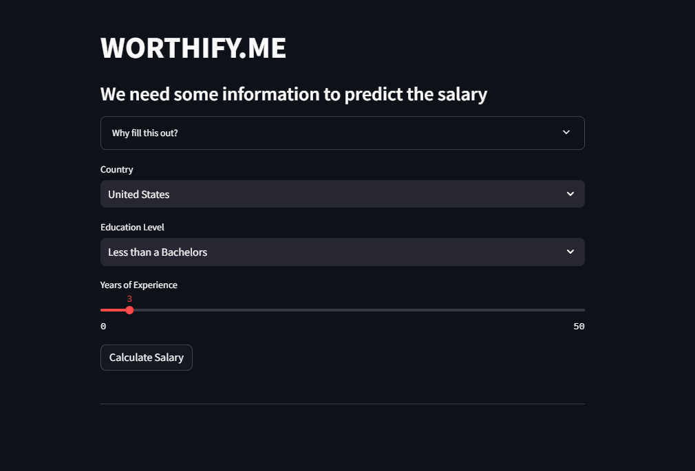
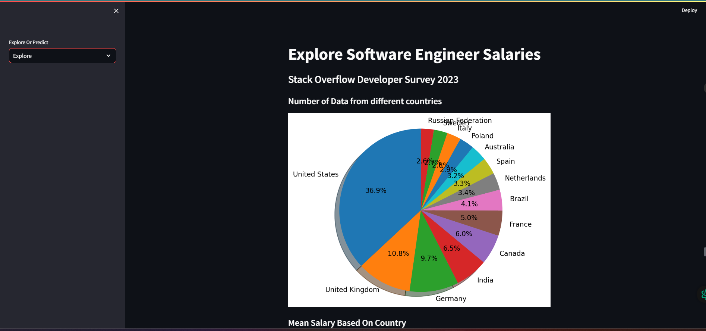
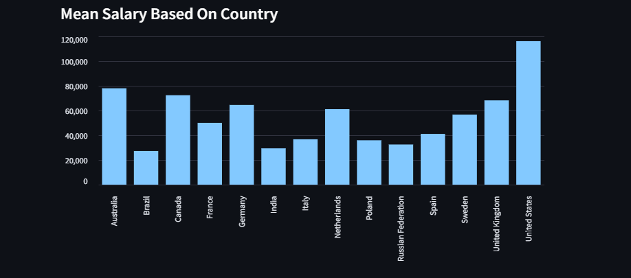
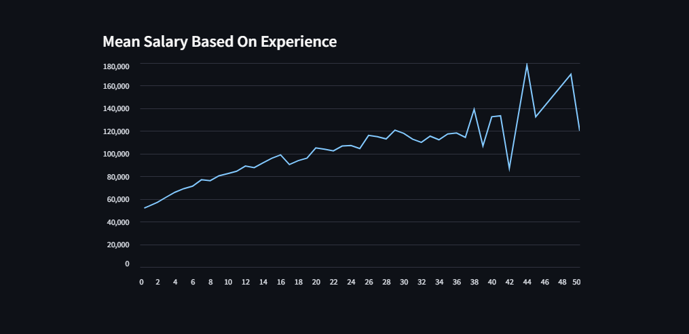

## Salary Prediction - Machine Learning Web App [Python, Machine Learning]

Hello! Welcome to "Salary Prediction".

## About This Project

This is a web-based Machine Learning application developed in Python using Streamlit. It utilizes real-world data to build a machine learning model to predict salaries. The project includes data analysis, model building, and the creation of a web interface using Streamlit.

## Installation

To get this project running on your local machine, follow these steps:

Clone the repository using the provided URL with the command: git clone : https://github.com/shanskarBansal/WORTHIFY.ME
Run pip install streamlit to install Streamlit.
Execute the command streamlit run app.py in your command prompt to start the application.

## Technologies Used

Python
Machine Learning Algorithms
Jupyter Notebook
Visual Studio Code (IDE)
Git
Screenshots

## Screen Shots

